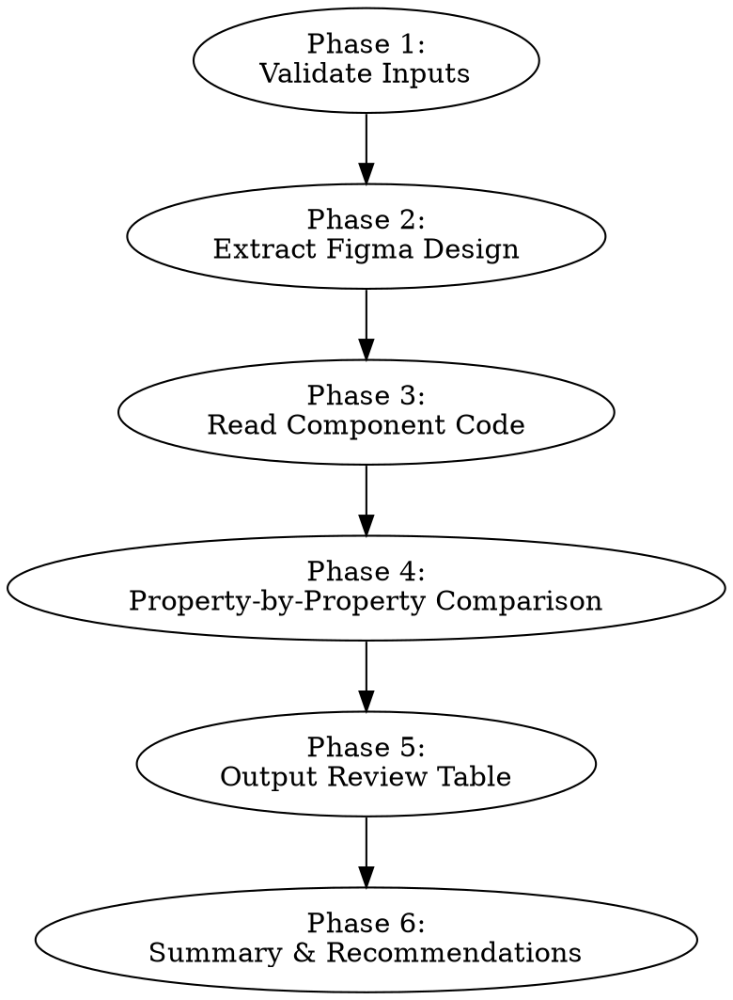

# 1money-component-review

## Activation

**Act when**: User invokes `/1money-component-review` with a Figma URL and component name to verify design fidelity.
**Goal**: Compare the implemented component against the Figma design source-of-truth, checking every visual property, and output a structured table showing pass/fail status for each item.

## Inputs

- **Figma URL** (required): The Figma design link for the component to review.
- **Component Name** (required): PascalCase name of the existing component in `src/components/`.

## Workflow



### Phase 1 — Validate Inputs

1. Confirm the component exists at `src/components/{Name}/`.
2. Parse the Figma URL to extract `fileKey` and `nodeId`.
3. If either input is missing, ask the user before proceeding.

### Phase 2 — Extract Figma Design

Extract all design data from Figma using MCP tools:

1. **`mcp__figma__get_design_context(nodeId, fileKey)`** — Get code hints and structure.
2. **`mcp__figma__get_screenshot(nodeId, fileKey)`** — Get visual screenshot for layout/spacing reference.
3. **`mcp__figma__get_variable_defs(nodeId, fileKey)`** — Get design tokens (colors, spacing, radii, typography).

From the extracted data, build a **Design Spec** covering:
- All color values (background, text, icon, border) per variant and state
- Spacing values (padding, gap, margin)
- Typography (font family, size, weight, line-height)
- Border radius
- Shadows
- Component heights/widths
- Icon usage and sizes
- All variants (color, size, state)
- Layout structure (flex direction, alignment, gap)

### Phase 3 — Read Component Code

Read all component files:

1. `src/components/{Name}/{Name}.tsx` — Component logic and structure
2. `src/components/{Name}/interface.ts` — Props interface
3. `src/components/{Name}/style/{Name}.scss` — Styles
4. `src/components/{Name}/{Name}.stories.tsx` — Stories (if exists)

Also read the token source files for color verification:

5. `src/styles/tokens/color/_semantic-color.scss` — Semantic token → primitive mapping
6. `src/styles/tokens/color/_primitives.scss` — Primitive → hex value definitions

Extract the **Implementation Spec**:
- All token function calls (`theme.palette()`, `theme.spacing()`, `theme.shape()`, `theme.typography()`, `theme.sizing()`, `theme.shadows()`)
- CSS custom properties and variant DSL values
- Variant names and their token mappings
- State handling (hover, disabled, active, focus)
- Layout properties (display, flex, gap, alignment)
- Icon components used and their props

### Phase 4 — Property-by-Property Comparison

Compare each design property against the implementation. Check every item in these categories:

#### 4.1 Colors (per variant, per state)

**CRITICAL: Token-to-Hex Verification**

Never mark a color as ✅ or ⚠️ based on token name alone. For every color comparison, you MUST complete the full verification chain:

1. Get the Figma hex value (from `get_variable_defs` or design context CSS variables)
2. Identify the SCSS token used in code (e.g., `theme.palette(icon, 'neutral-secondary')`)
3. Trace the token through `src/styles/tokens/color/_semantic-color.scss` to find the primitive reference (e.g., `p.$grey-500`)
4. Resolve the primitive in `src/styles/tokens/color/_primitives.scss` to get the actual hex value (e.g., `$grey-500: #9fa3a3`)
5. Compare the resolved hex against the Figma hex — mark ✅ if they match, ❌ if they don't

In the review table, always include the resolved hex value:
```
| Icon color | info | #073387 | `theme.palette(icon, 'brand')` → `$blue-700` → #073387 | ✅ |
| Close icon | all  | #646465 | `theme.palette(icon, 'neutral-secondary')` → `$grey-500` → #9fa3a3 | ❌ |
```

For each variant × state combination:
- [ ] Background color matches Figma (verified via hex)
- [ ] Text color matches Figma (verified via hex)
- [ ] Icon color matches Figma (verified via hex)
- [ ] Border color matches Figma (verified via hex, if applicable)

#### 4.2 Typography

Check in two steps:

**Step 1 — Extract Figma text style name** (e.g., `Headline(Beta)/Small`, `Body(Beta)/Large`, `Title(Beta)/Medium Strong`)

**Step 2 — Verify `<Typography>` component usage and mapping**

All text rendering MUST use the `Typography` compound component (`@/components/Typography`). The component exposes sub-components per category: `Typography.Display`, `Typography.Headline`, `Typography.Title`, `Typography.Body`, `Typography.Label`, `Typography.Link`.

If the Figma text style maps correctly to the right `Typography.*` sub-component + `size` prop, the font properties (family, size, weight, line-height) are automatically correct — no need to check pixel values individually.

Figma style → Typography component mapping:

| Figma Text Style | Typography Component | Props |
|---|---|---|
| `Display(Beta)/XL` | `<Typography.Display size="xl">` | |
| `Display(Beta)/Large` | `<Typography.Display size="lg">` | |
| `Display(Beta)/Medium` | `<Typography.Display size="md">` | |
| `Display(Beta)/Small` | `<Typography.Display size="sm">` | |
| `Display(Beta)/XS` | `<Typography.Display size="xs">` | |
| `Headline(Beta)/Large` | `<Typography.Headline size="lg">` | |
| `Headline(Beta)/Medium` | `<Typography.Headline size="md">` | |
| `Headline(Beta)/Small` | `<Typography.Headline size="sm">` | |
| `Headline(Beta)/XS` | `<Typography.Headline size="xs">` | |
| `Title(Beta)/Large` | `<Typography.Title size="lg">` | |
| `Title(Beta)/Medium` | `<Typography.Title size="md">` | |
| `Title(Beta)/Medium Strong` | `<Typography.Title size="md" strong>` | `strong` |
| `Title(Beta)/Small` | `<Typography.Title size="sm">` | |
| `Body(Beta)/Large` | `<Typography.Body size="lg">` | |
| `Body(Beta)/Medium` | `<Typography.Body size="md">` | |
| `Body(Beta)/Small` | `<Typography.Body size="sm">` | |
| `Label(Beta)/XL` | `<Typography.Label size="xl">` | |
| `Label(Beta)/Large` | `<Typography.Label size="lg">` | |
| `Label(Beta)/Medium` | `<Typography.Label size="md">` | |
| `Label(Beta)/Small` | `<Typography.Label size="sm">` | |
| `Label(Beta)/XS` | `<Typography.Label size="xs">` | |
| `Link(Beta)/Medium` | `<Typography.Link size="md">` | |
| `Link(Beta)/Small` | `<Typography.Link size="sm">` | |

Additional Typography props to check:

- `color` — maps to `TypographyColor` (e.g., `"default"`, `"default-secondary"`, `"brand"`, `"disabled"`)
- `strong` — only available on `Typography.Title`, `Typography.Body`, `Typography.Label`
- `as` — override the HTML tag (e.g., `as="h2"` for semantic heading)

Checklist:

- [ ] All text elements use `Typography.*` sub-components — no raw `<p>`, `<span>`, `<h1>`–`<h6>`, or `<div>` for text rendering
- [ ] No SCSS `@include theme.typography(...)` used directly — typography is handled by `Typography.*` components, not SCSS
- [ ] Each text element uses the correct `Typography.*` sub-component matching the Figma text style category (Display/Headline/Title/Body/Label/Link)
- [ ] Each `size` prop matches the corresponding Figma text style size
- [ ] `strong` prop is set when Figma uses a Strong/Bold variant (e.g., `Title(Beta)/Medium Strong`)
- [ ] `color` prop matches the Figma text color token (e.g., Text/Default/Default → `color="default"`)
- [ ] If Figma text style cannot be mapped to a known Typography variant, flag as ❌

#### 4.3 Spacing

- [ ] Padding top/right/bottom/left matches
- [ ] Gap between children matches
- [ ] Margin matches (if applicable)

#### 4.4 Visual Properties

- [ ] Border radius matches
- [ ] Box shadow matches
- [ ] Opacity matches (if applicable)
- [ ] Border width and style matches (if applicable)

#### 4.5 Sizing

- [ ] Component height matches (per size variant)
- [ ] Component width matches (if fixed)
- [ ] Icon size matches
- [ ] Min/max constraints match

#### 4.6 Layout

- [ ] Flex direction matches
- [ ] Alignment (align-items, justify-content) matches
- [ ] Element ordering matches

#### 4.7 States

- [ ] Default state matches
- [ ] Hover state matches
- [ ] Disabled state matches
- [ ] Active/pressed state matches (if applicable)
- [ ] Focus state matches (if applicable)
- [ ] Selected/checked state matches (if applicable)

#### 4.8 Variants Coverage

- [ ] All Figma variants are implemented
- [ ] No extra variants exist that aren't in Figma
- [ ] Default variant matches Figma default

#### 4.9 Icons

- [ ] Correct icon names used
- [ ] Icon sizes match Figma
- [ ] Icon colors match per variant/state

### Phase 5 — Output Review Table

Present results as a detailed Markdown table. Use these status markers:

| Marker | Meaning |
|--------|---------|
| ✅ | Matches Figma exactly |
| ⚠️ | Close but has minor deviation |
| ❌ | Does not match / missing |
| ➖ | Not applicable |

**Output format:**

```markdown
## Design Review: {ComponentName}

### Colors

| Property | Variant | State | Figma Value | Implementation | Token Used | Status |
|----------|---------|-------|-------------|----------------|------------|--------|
| Background | primary | default | #1D4ED8 | `theme.palette(bg, 'brand')` → blue-700 | `bg-brand` | ✅ |
| Background | primary | hover | #1E40AF | `theme.palette(bg, 'brand-hover')` → blue-800 | `bg-brand-hover` | ✅ |
| Text | primary | default | #FFFFFF | `theme.palette(text, 'on-brand')` | `text-on-brand` | ✅ |

### Typography

| 文本元素 | Figma 样式 | 期望组件 | 实际实现 | 使用 Typography | 状态 |
|----------|-----------|---------|----------|----------------|------|
| 标题 | `Headline(Beta)/Small` | `<Typography.Headline size="sm">` | `<Typography.Headline size="sm">` | ✅ | ✅ |
| 内容 | `Body(Beta)/Large` | `<Typography.Body size="lg">` | `<span>` (原生标签) | ❌ | ❌ |

### Spacing

| Property | Variant/Size | Figma Value | Implementation | Token Used | Status |
|----------|-------------|-------------|----------------|------------|--------|
| Padding H | medium | 16px | `theme.spacing(component-padding, 400)` | `cp-400` | ✅ |
| Gap | all | 8px | `theme.spacing(gap, 200)` | `gap-200` | ✅ |

### Visual Properties

| Property | Figma Value | Implementation | Token Used | Status |
|----------|-------------|----------------|------------|--------|
| Border Radius | 12px | `theme.shape(300)` | `shape-300` | ✅ |
| Shadow | none | none | — | ✅ |

### Sizing

| Property | Variant/Size | Figma Value | Implementation | Token Used | Status |
|----------|-------------|-------------|----------------|------------|--------|
| Height | medium | 40px | `theme.sizing(component-height, md)` | `ch-md` | ✅ |

### States

| State | Variant | Property | Figma | Implementation | Status |
|-------|---------|----------|-------|----------------|--------|
| hover | primary | bg | blue-800 | `bg-brand-hover` | ✅ |
| disabled | primary | bg | grey-100 | `bg-disabled` | ✅ |
| disabled | primary | cursor | not-allowed | `cursor: not-allowed` | ✅ |

### Variants Coverage

| Figma Variant | Implemented | Status |
|---------------|------------|--------|
| primary | yes | ✅ |
| secondary | yes | ✅ |
| ghost | no | ❌ |

### Icons

| Icon Slot | Figma Icon | Implementation | Size Match | Color Match | Status |
|-----------|-----------|----------------|------------|-------------|--------|
| iconStart | arrow-left | `<Icons name="arrow-left" />` | ✅ | ✅ | ✅ |
```

### Phase 6 — Summary & Recommendations

After the table, provide:

1. **Score**: `{passed}/{total}` items matching (`{percentage}%`)
2. **Critical Issues** (❌): List each mismatch with the fix needed
3. **Minor Issues** (⚠️): List deviations that may be acceptable
4. **Missing Features**: Variants/states in Figma not implemented

Example:
```markdown
### Summary

**Score: 28/32 (87.5%)**

#### Critical Issues (❌)
1. `ghost` variant exists in Figma but is not implemented
2. Disabled background for `secondary` uses `bg-disabled` but Figma shows `bg-default-secondary`

#### Minor Issues (⚠️)
1. Hover transition duration is 200ms in code but 150ms in Figma

#### Missing Features
- `ghost` variant (3 states: default, hover, disabled)
```

## Constraints

- **Do NOT modify any code** — this skill is read-only review. Report findings only.
- **Do NOT guess values** — if a Figma value cannot be determined from MCP data, mark as `⚠️ Unable to verify` and note why.
- **Compare against Figma as source of truth** — if code differs from Figma, it is a mismatch regardless of whether the code "looks right."
- **Check ALL variants and states** — do not skip any variant × state combination visible in Figma.
- **Use the style system references** — consult `SemanticColors.md` and `StyleSystemAPI.md` from the `1money-component-dev` skill to verify token mappings are correct.
