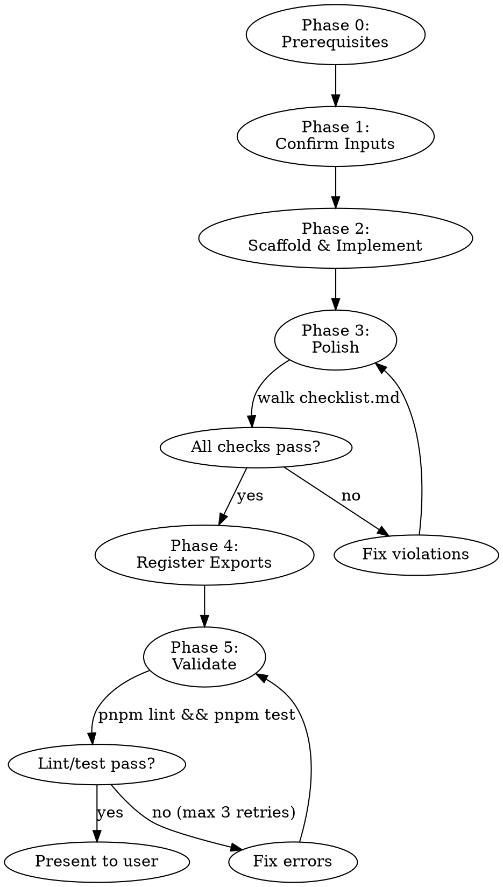

# component-pipeline

## Activation

**Act when**: User invokes `/component-pipeline` with a Figma URL to build a new component for `@1money/components-ui`.
**Goal**: Orchestrate the full pipeline — confirm inputs, delegate implementation to `1money-component-dev`, polish output against repo conventions, register exports, and validate.

## Resources

- **Polish Checklist**: `checklist.md`
- **Implementation Skill**: `1money-component-dev` (handles Figma extraction, scaffolding, and implementation)

## Inputs

- **Figma URL** (required): Design source URL for the component.
- **Component Name** (optional): PascalCase name. If not provided, derive from Figma frame name.

## Workflow



### Phase 0 — Prerequisites

Before starting, verify all three conditions. If any fails, stop and inform the user:

1. Component does not already exist: check `src/components/{Name}/` does not exist.
2. `@1money/hooks` is available: check `node_modules/@1money/hooks` exists.
3. Figma MCP is accessible: attempt a simple `mcp__figma__get_metadata` call on the provided URL.

### Phase 1 — Confirm Inputs *(gate — do not proceed until resolved)*

1. **Figma URL**: If not provided as argument, ask the user now.
2. **Component Name**: If not provided, derive from the Figma frame name. Validate it is PascalCase. If the name conflicts with an existing PrimeReact component already in the library, suggest appending `Beta`.
3. **Output Mode**: Ask only if ambiguous. Default is `Code`.

### Phase 2 — Scaffold & Implement

Invoke the `1money-component-dev` skill with:
- Figma URL from Phase 1
- Component Name from Phase 1
- Output Mode: `Code`

This skill handles everything: Figma extraction via MCP, token mapping, file scaffolding (8 files), variant DSL, hooks, classnames, and its own internal checklist.

Wait for `1money-component-dev` to complete before proceeding.

### Phase 3 — Polish *(mandatory)*

Walk through `checklist.md` item by item. For each item:
1. Read the generated file
2. Compare against the reference pattern (listed in the checklist)
3. If violation found: fix it immediately
4. Move to next item

This phase catches what `1money-component-dev` may miss — the precise code style and conventions of this specific repo, verified against actual Button, Checkbox, and Tag source files.

**Do not skip this phase.** Even if `1money-component-dev` ran its own checklist, the polish checklist verifies against the actual codebase patterns, not template expectations.

### Phase 4 — Register Exports

1. **Read `src/index.ts` first** — do not assume a barrel pattern. Match the existing style exactly.
2. Add an import statement for the new component, matching the format of existing imports.
3. If the file has export statements, add matching exports and a type export for the Props interface (e.g., `export type { {Name}Props } from './components/{Name}'`). If it only has imports (current state), add only an import.
4. **Check `package.json` exports**: If the component is not already listed in the `"exports"` field, add a tree-shakeable entry:

```json
"./{Name}": {
  "types": "./es/components/{Name}/index.d.ts",
  "import": "./es/components/{Name}/index.js",
  "require": "./lib/components/{Name}/index.js"
}
```

### Phase 5 — Validate

1. Run `pnpm lint`. If errors, fix and re-run (max 3 attempts).
2. Run `pnpm test`. If snapshot failures are expected (new component), update with `pnpm test -- -u`. If real failures, fix.
3. Run `pnpm dev` briefly to verify Storybook compiles without errors for the new component, then stop the server.
4. Present the completed component to the user for review: list all created/modified files and summarize what was built.

## Error Handling

- **Phase 0 failure**: Stop and inform user which prerequisite failed.
- **Phase 2 failure** (MCP errors, skill issues): Report details to user and ask how to proceed.
- **Phase 3 violations**: Fix inline — do not ask user for each violation.
- **Phase 5 lint/test failures**: Fix and retry up to 3 times, then surface to user.

## Constraints

- **Do NOT invoke** `figma-1money-codegen` — it targets consumer code (`@1money/components-ui` usage), not this library's internals.
- **Do NOT invoke** `1money-front-code-review` — it targets consumer code patterns and would produce false positives.
- **Do NOT duplicate** content from `1money-component-dev` — this skill orchestrates, it does not re-implement.
- **Always read before writing** `src/index.ts` — match the actual barrel pattern, not template expectations.
